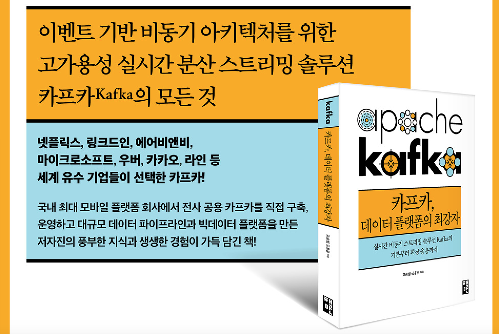

# 카프카, 데이터 플랫폼의 최강자
### 부제: 실시간 비동기 스트리밍 솔루션 Kafka의 기본부터 확장 응용까지
#### | 고승범, 공용준 지음 | [책만](www.onlybook.co.kr) |

| 432쪽 | 30,000원 | 2018년 4월 26일 출간 | ISBN 9791196203726 |
 

판매처: [교보문고](http://www.kyobobook.co.kr/product/detailViewKor.laf?barcode=9791196203726), [YES24](http://www.yes24.com/24/goods/59789254), [인터파크](http://book.interpark.com/product/BookDisplay.do?_method=detail&sc.shopNo=0000400000&sc.prdNo=282814470), [알라딘](http://www.aladin.co.kr/shop/wproduct.aspx?ItemId=142100738), [강컴](http://www.kangcom.com/sub/view.asp?sku=201804170005), [반디앤루니스](http://www.bandinlunis.com/front/product/detailProduct.do?prodId=4168488)

> __데이터 플랫폼의 핵심 컴포넌트로 각광받고 있는, 이벤트 기반 비동기 아키텍처를 위한 고가용성 실시간 분산 스트리밍 솔루션 카프카(Kafka)의 모든 것!__ 

> __국내 최대 모바일 플랫폼 회사인 카카오에서 '전사 공용 카프카' 서비스를 운영하고, 데이터 파이프라인과 빅데이터 플랫폼을 구축한 저자들의 풍부한 지식, 생생한 실전 경험, 노하우가 가득 담긴 책!__ 

> 카프카 사용자는 물론이고 아직 카프카를 도입하지 않은 기업이나 담당자들을 대상으로, 카프카를 손쉽게 설치하고 구성하는 방법, 비동기 메시지 처리법과 함께 프로그램 개발 방법도 차근차근 익혀본다. 또한, 손쉽게 메시징 시스템을 도입할 수 있도록 카프카의 내부 디자인과 프로듀서/컨슈머의 특징을 심도 있게 다뤘다. 아울러, 카프카를 데이터 버스로 활용해서 실시간 데이터를 분석하는 방법을 여러 방면의 예를 들어 자세히 설명하고, 카프카 기반의 실시간 데이터 분석 시스템을 개발하는 과정을 자세한 설명과 함께 샘플코드도 제공하고 있어서 **실시간/배치 분석 업무를 수행하는 빅데이터 분석가나 데이터 엔지니어, 이벤트 기반 방식의 비동기 시스템 개발 업무를 맡은 모든 개발자**에게 도움이 될 것이다.

## 이 책의 독자 대상
- 카프카를 배우고자 하는 초보자부터 카프카를 직접 운영하는 관리자
- 데이터 표준화와 실시간 처리에 대해 고민하는 개발자
- 이벤트 소싱을 활용한 데이터 처리를 활용하려는 개발자
- 효율적으로 데이터를 수집하고 처리, 분석하기를 원하는 개발자
- 실시간 데이터 파이프라인을 구축하고 애플리케이션을 개발하는 아키텍트와 개발자
- 이벤트 기반 방식의 비동기 시스템 개발 업무를 맡은 모든 개발자
 

## 이 책의 내용과 특징
- 카프카의 탄생 배경과 동작 원리
- 주키퍼와 카프카 설치 및 클러스터 구성에 대한 자세한 설명
- 자바와 파이썬을 이용한 카프카 프로듀서와 컨슈머의 예제 코드와 활용 
- 카프카 운영에 필요한 주요 명령어 설명
- 주키퍼와 카프카의 노드 추가와 스케일 아웃 가이드
- 편리한 GUI 도구인 카프카 매니저의 설치와 활용
- 이해하기 쉽게 그림으로 설명하는 주요 카프카 아키텍처
- 카프카를 활용한 실시간 스트림 분석 완벽 가이드
- 엘라스틱서치와 아파치 나이파이 등을 활용한 데이터 파이프라인 구성 예제
 

## 지은이 소개
### 고승범 
현재 카카오에 재직 중인 시스템 엔지니어로서 카카오와 관련된 여러 서비스를 지원하며 전사 공용 카프카와 래빗엠큐를 운영하고 있다. 새로운 것에 호기심이 많은 편이며 열심히 노력하는 엔지니어다. 팝잇(Popit.kr) 사이트의 저자로 활동 중이며 카프카 관련 글을 연재하고 있다. 

### 공용준 
국내 최대 메신저 회사에서 클라우드 서비스 개발 리딩을 맡고 있으며, 데이터 센터 자동화, 프라이빗/퍼블릭 클라우드 서비스와 그에 필요한 기술을 연구, 개발해서 실제 서비스에 적용하고 있다. 2015년에는 캐나다 밴쿠버에서 열린 오픈스택 서밋에서 국내 개발자 중 최초로 ‘SDN without SDN’이라는 제목으로 발표했고, 2016년(도쿄)과 2017년(몬트리얼) Netdev 컨퍼런스에서 역시 국내 최초로 확장가능한 컨테이너 네트워크에 대해 발표했다. 한국 데이터베이스 진흥원 자문위원, 클라우드컴퓨팅조합에서 멘토로도 활동 중이다. 

## 차례
## 1부 카프카를 시작하며
### 1장  카프카란 무엇인가
1.1  카프카의 탄생 배경 
1.2  카프카의 동작 방식과 원리 
1.3  카프카의 특징 
1.4  카프카의 확장과 발전 
1.5  정리 

### 2장  카프카와 주키퍼 설치
2.1  카프카 관리를 위한 주키퍼 
2.2  주키퍼 설치 
2.3  카프카 설치 
2.4  카프카 상태 확인 
2.5  카프카 시작하기 
2.6  정리 

## 2부 기본 개념과 운영 가이드
### 3장  카프카 디자인
3.1  카프카 디자인의 특징  
3.2  카프카 데이터 모델 
3.3  카프카의 고가용성과 리플리케이션 
3.4  모든 브로커가 다운된다면 
3.5  카프카에서 사용하는 주키퍼 지노드 역할 
3.6  정리 

### 4장  카프카 프로듀서
4.1  콘솔 프로듀서로 메시지 보내기 
4.2  자바와 파이썬을 이용한 프로듀서 
4.3  프로듀서 활용 예제 
4.4  프로듀서 주요 옵션 
4.5  메시지 전송 방법 
4.6  정리 

### 5장  카프카 컨슈머
5.1  컨슈머 주요 옵션 
5.2  콘솔 컨슈머로 메시지 가져오기 
5.3  자바와 파이썬을 이용한 컨슈머 
5.4  파티션과 메시지 순서 
5.5  컨슈머 그룹 
5.6  커밋과 오프셋 
5.7  정리 

### 6장  카프카 운영 가이드
6.1  필수 카프카 명령어 
6.2  주키퍼 스케일 아웃 
6.3  카프카 스케일 아웃 
6.4  카프카 모니터링 
6.5  카프카 매니저 
6.6  카프카 운영에 대한 Q&A 
6.7  정리 

## 3부 카프카의 확장과 응용
### 7장  카프카를 활용한 데이터 파이프라인 구축
7.1  카프카를 활용한 데이터 흐름도 
7.2  파일비트를 이용한 메시지 전송 
7.3  나이파이를 이용해 메시지 가져오기 
7.4  실시간 분석을 위해 엘라스틱서치에 메시지 저장 
7.5  키바나를 이용해 엘라스틱서치에 저장된 데이터 확인 
7.6  현재의 토픽을 이용해 새로운 토픽으로 메시지 재생산 
7.7  정리 

### 8장 카프카 스트림즈 API
8.1  스트림 프로세싱 기초 
8.2  카프카 스트림즈 
8.3  카프카 스트림즈를 위한 환경설정 
8.4  파이프 예제 프로그램 만들기  
8.5  행 분리 예제 프로그램 만들기 
8.6  단어 빈도수 세기 예제 프로그램 만들기 
8.7  정리 

### 9장  카프카 SQL을 이용한 스트리밍 처리
9.1  KSQL의 등장 배경 
9.2  KSQL과 카파 아키텍처 
9.3  KSQL 아키텍처 
9.4  도커를 이용한 KSQL 클러스터 설치 
9.5  KSQL을 이용한 스트림 분석 
9.6  정리 

### 10장  그 밖의 클라우드 기반 메시징 서비스
10.1  구글의 펍/섭 서비스 소개 
10.2  구글의 펍/섭 서비스 연동 
10.3  펍/섭 파이썬 SDK 사용하기 
10.4  아마존 키네시스 서비스 소개 
10.5  아마존 키네시스 연동 
10.6  아마존 키네시스 자바 SDK 사용하기 
10.7  카프카와 클라우드 서비스와의 비교v
10.8  정리 

### 부록 도커를 이용한 카프카 설치
A.1  도커 설치 
A.2  도커 버전 카프카 설치
